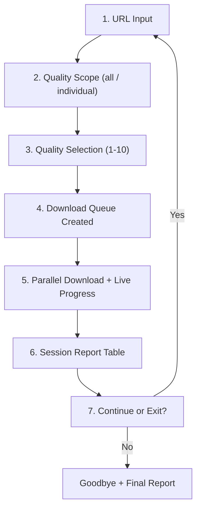
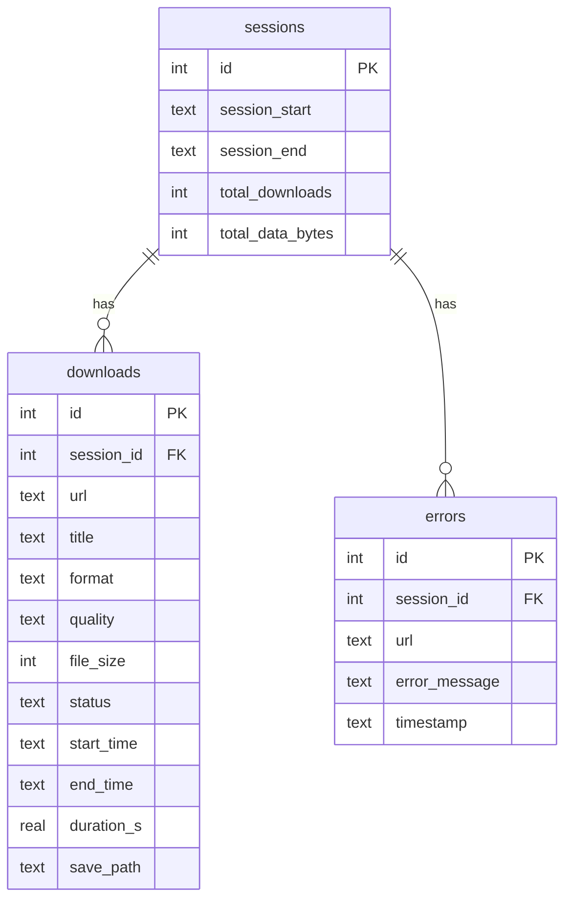
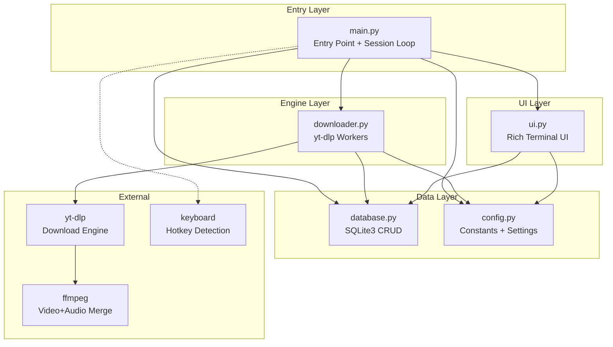
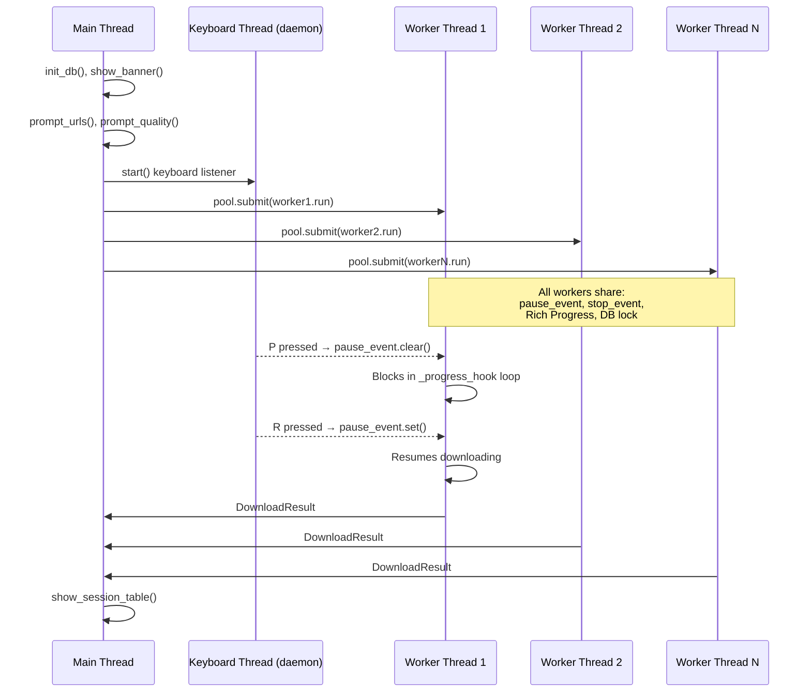
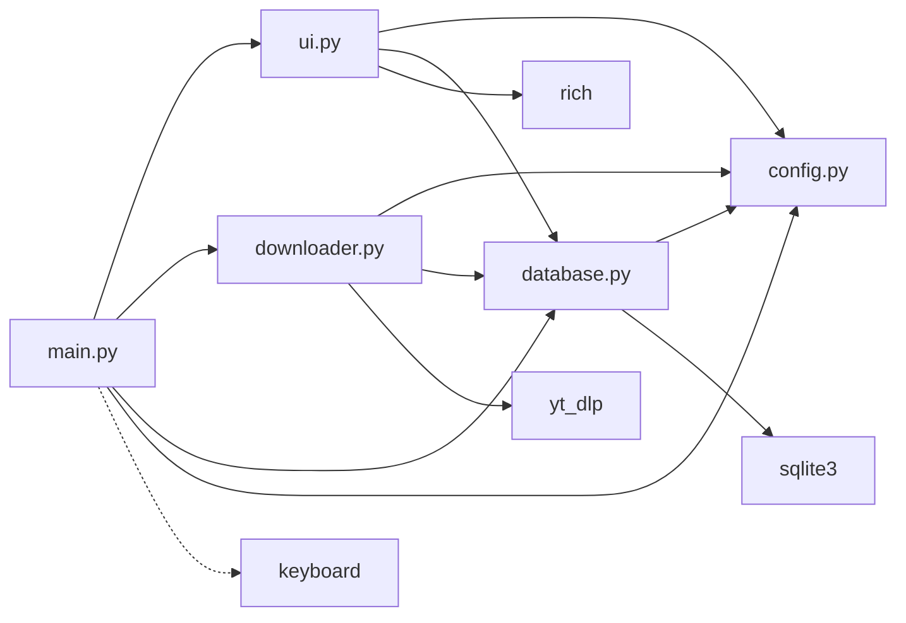

# 📋 AURI V1 — Complete Detailed Report

> **Project**: AURI V1 — Smart Media Downloader  
> **Version**: 2.0 | **Language**: Python 3.11+  
> **Engine**: yt-dlp | **UI**: Rich Terminal  
> **Report Date**: April 29, 2026

---

## 1. The Idea & Vision

**AURI** (Automated Universal Resource Interceptor) is a **CLI-based smart media downloader** built in Python. The core idea is simple but powerful:

> *Give it any URL (YouTube, playlist, or supported media link) → pick a quality → watch it download with beautiful real-time progress bars → get a full session report logged in a database.*

### What Makes It "Smart"
- **Parallel downloads** — up to 8 simultaneous workers via `ThreadPoolExecutor`
- **Real-time controls** — Pause (`P`), Resume (`R`), Stop (`S`) via keyboard hotkeys mid-download
- **Database logging** — every download, session, and error is tracked in SQLite
- **Rich terminal UI** — no raw `print()` statements; everything goes through Rich panels, tables, and progress bars
- **Playlist awareness** — paste a playlist URL and it expands automatically

---

## 2. Application Flow (7 Steps)



| Step | What Happens | File |
|------|-------------|------|
| **1** | User pastes URL(s) — single, comma-separated, or playlist | `ui.py` → `prompt_urls()` |
| **2** | Choose scope: **(a)** same quality for all, or **(i)** per-video | `ui.py` → `prompt_quality_scope()` |
| **3** | Pick quality from 10 presets (4K → 144p) | `ui.py` → `prompt_quality()` |
| **4** | `DownloadWorker` objects are created, one per URL | `main.py` → `run_session()` |
| **5** | Workers run in `ThreadPoolExecutor`, keyboard listener starts | `downloader.py` + `main.py` |
| **6** | Session report table is printed from DB data | `ui.py` → `show_session_table()` |
| **7** | User decides to download more or exit | `ui.py` → `prompt_continue()` |

---

## 3. Complete File-by-File Breakdown

### 3.1 `config.py` — Central Configuration (85 lines)

**Purpose**: Single source of truth for every constant, path, and mapping.

| Section | Key Items |
|---------|-----------|
| **App Identity** | `APP_NAME = "AURI"`, `APP_VERSION = "2.0"`, `APP_TAGLINE` |
| **Paths** | `BASE_DIR` (project root via `__file__`), `DOWNLOAD_FOLDER` (auto-created), `DB_PATH` |
| **Engine** | `MAX_WORKERS = 8`, `CONCURRENT_FRAGMENT_DOWNLOADS = 5`, `MERGE_OUTPUT_FORMAT = "mp4"` |
| **Quality Map** | 10 entries mapping `"1"` through `"10"` to `(label, yt-dlp format string)` |
| **Theme Colors** | 8 Rich color constants (`COLOR_PRIMARY`, `COLOR_ACCENT`, etc.) |
| **`get_ydl_base_opts()`** | Factory function returning a fresh yt-dlp options `dict` per download |

**Logic**: The quality map uses yt-dlp format selectors like `bestvideo[height<=1080]+bestaudio/best` — this tells yt-dlp to grab the best video stream at/below 1080p, the best audio, and merge them (requires ffmpeg).

---

### 3.2 `database.py` — SQLite3 Database Layer (268 lines)

**Purpose**: Thread-safe CRUD for tracking downloads, sessions, and errors.

#### Schema (3 Tables)



#### Thread Safety
- A module-level `threading.Lock()` (`_db_lock`) wraps **every** DB operation
- Each operation opens a fresh connection (`_connect()`), does its work, then closes
- Uses `PRAGMA journal_mode=WAL` for better concurrent write performance

#### Public API

| Function | Purpose |
|----------|---------|
| `init_db()` | Creates tables if they don't exist |
| `start_session()` → `int` | Inserts new session row, returns ID |
| `end_session(id)` | Updates session with totals via subquery |
| `log_download_start()` → `int` | Inserts download row with status `'downloading'` |
| `log_download_complete()` | Updates row with title, size, path, duration |
| `log_download_failed()` | Sets status to `'failed'` |
| `log_download_stopped()` | Sets status to `'stopped'` |
| `update_download_title()` | Persists video title once yt-dlp resolves it |
| `log_error()` | Inserts into the `errors` table |
| `get_session_downloads()` | Returns all downloads for a session |
| `get_session_summary()` | Returns aggregate stats (counts, total bytes, duration) |

---

### 3.3 `downloader.py` — Core Download Engine (246 lines)

**Purpose**: Wraps yt-dlp in a thread-safe worker class with pause/resume/stop.

#### Key Components

**`DownloadResult`** (dataclass)
- Fields: `url`, `success`, `title`, `save_path`, `file_size`, `error`

**Global Events**
- `pause_event` — `threading.Event()`, cleared = paused, set = running (initialized to set)
- `stop_event` — `threading.Event()`, set = stop all downloads

**`DownloadWorker`** (class)
- One instance per URL
- Tracks: `url`, `quality_label`, `format_code`, `session_id`, Rich `progress` ref, `task_counter`
- Internal state per video: `_current_task_id`, `_current_download_id`, `_current_title`, `_current_start_time`

#### The Progress Hook (`_progress_hook`)

This is the heart of the download system. yt-dlp calls this function on every progress event:

```
1. Check stop_event → raise DownloadError to abort
2. While pause_event is cleared → sleep 250ms in a loop (blocking the thread)
3. If status == "downloading":
   - First time: create Rich progress task + DB row
   - Subsequent: update progress bar with downloaded_bytes
4. If status == "finished":
   - Mark bar 100%, log completion to DB, reset state for next playlist video
5. If status == "error":
   - Log failure to DB, mark bar with ✘
```

#### The `run()` Method

```python
def run(self) -> DownloadResult:
    opts = get_ydl_base_opts(...)
    opts["progress_hooks"] = [self._progress_hook]
    with yt_dlp.YoutubeDL(opts) as ydl:
        ydl.download([self.url])
    # Exception handling for DownloadError ("Stopped by user") vs other errors
```

**`TaskCounter`** — thread-safe integer counter (lock-protected), used for unique task IDs.

---

### 3.4 `ui.py` — Rich Terminal UI (385 lines)

**Purpose**: All terminal output lives here. Zero raw `print()` calls.

#### Components

| Component | Function | Description |
|-----------|----------|-------------|
| **Banner** | `show_banner()` | ASCII art logo + version in a Rich Panel |
| **URL Prompt** | `prompt_urls()` | Input with validation, comma-split, empty check |
| **Quality Scope** | `prompt_quality_scope()` | Returns `'a'` or `'i'` with validation loop |
| **Quality Menu** | `prompt_quality()` | Rich Table with 10 options, returns `(label, format_code)` |
| **Continue** | `prompt_continue()` | Yes/No prompt |
| **Stop Confirm** | `prompt_stop_confirm()` | Confirmation before stopping all downloads |
| **Progress** | `make_progress()` | Factory returning configured `Progress` with 7 columns |
| **Controls** | `controls_panel()` | Static panel showing P/R/S shortcuts |
| **Session Table** | `show_session_table()` | Full report table + summary panel from DB data |
| **Error Panel** | `show_error_panel()` | Red-bordered error display |
| **Goodbye** | `show_goodbye()` | Final session table + farewell message |

#### Progress Bar Columns
`Spinner → Filename → Bar → Percentage → Download Size → Speed → ETA`

#### Helper Functions
- `_fmt_bytes(n)` — Converts bytes to human-readable (B/KB/MB/GB/TB)
- `_fmt_duration(secs)` — Converts seconds to `Xh Ym Zs` format

---

### 3.5 `main.py` — Entry Point & Session Manager (237 lines)

**Purpose**: Orchestrates the entire application lifecycle.

#### `KeyboardController` (class)
- Runs in a **daemon thread**
- Uses `keyboard.read_event()` to detect key presses
- `P` → clears `pause_event` (pauses downloads)
- `R` → sets `pause_event` (resumes downloads)
- `S` → calls `prompt_stop_confirm()`, then sets `stop_event` + `pause_event`
- Gracefully falls back if `keyboard` package isn't installed

#### `run_session(session_id)` — The Core Loop

```python
1. Reset stop/pause events
2. urls = prompt_urls()
3. scope = prompt_quality_scope()
4. Build quality_map (all-same or per-URL)
5. Create DownloadWorker[] for each URL
6. Launch ThreadPoolExecutor(max_workers=8)
7. Wrap in Rich Live context for real-time rendering
8. Collect results, show errors
9. end_session() + show_session_table()
```

#### `main()` — The Outer Loop

```python
1. init_db()
2. show_banner()
3. while True:
     session_id = start_session()
     run_session(session_id)
     if not prompt_continue(): break
4. Handle KeyboardInterrupt gracefully
```

#### Windows-Specific Fix (L231–236)
Sets `asyncio.WindowsSelectorEventLoopPolicy()` to avoid `ProactorEventLoop` deprecation warnings.

---

### 3.6 `telegram_downloader_bot.py` — Telegram Media Engine (137 lines)

**Purpose**: A **separate, standalone script** for downloading media from Telegram channels/messages.

| Component | Detail |
|-----------|--------|
| **Auth** | Telegram API credentials from `.env` via `python-dotenv` |
| **Client** | `Telethon` async client |
| **Progress** | `tqdm` progress bar (different from main app's Rich) |
| **Target** | Static channel/message IDs from `.env` |
| **UI** | `colorama` for colored terminal output |

> [!NOTE]
> This file is **independent** from the main AURI CLI. It uses different libraries (Telethon, tqdm, colorama) and doesn't share any modules with `main.py`.

---

### 3.7 `.env` — Environment Variables (17 lines)

Stores Telegram API credentials and target details:
- `TELEGRAM_API_ID` / `TELEGRAM_API_HASH` (placeholders)
- `TARGET_CHANNEL_ID` / `TARGET_MESSAGE_ID`
- `DOWNLOAD_DIR`

---

### 3.8 `requirements.txt` (9 lines)

| Package | Version | Purpose |
|---------|---------|---------|
| `yt-dlp` | ≥2024.3.10 | Media downloading engine |
| `rich` | ≥13.7.0 | Terminal UI |
| `keyboard` | ≥0.13.5 | Hotkey detection |

> [!IMPORTANT]
> The Telegram bot's dependencies (`telethon`, `python-dotenv`, `colorama`, `tqdm`) are **not** listed in this file. They must be installed separately.

---

### 3.9 `download_log.txt` — Legacy Log (85 lines)

A plain-text log from an **earlier version** of AURI (before the SQLite migration). Contains timestamped entries from Feb–Mar 2026 showing:
- Successful downloads
- Failed downloads with error messages
- Various URL types tested (YouTube, Telegram, Perplexity, Terabox, ApnaCollege)

---

### 3.10 `AURI/` — Planned Module Structure (Stubs Only)

This subfolder contains **empty placeholder files** for a planned modular architecture:

```
AURI/
├── config.py                    # "# config.py - AURI Config"
├── requirements.txt             # "# requirements.txt - AURI Config"
├── ai/
│   └── ai_commands.py           # empty stub
├── core/
│   ├── downloader_engine.py     # empty stub
│   ├── platform_detector.py     # empty stub
│   └── queue_manager.py         # empty stub
├── gui/
│   └── desktop_gui.py           # empty stub
├── organization/
│   └── file_organizer.py        # empty stub
└── web/
    └── dashboard.py             # empty stub
```

> [!NOTE]
> **None of these files contain any implementation code.** They represent the planned V2 architecture with AI commands, GUI, web dashboard, platform detection, and file organization features.

---

### 3.11 `downloads/` — Output Directory

Organized into subdirectories by content type:
- `videos/`, `Images/`, `files/`, `subtitles/`, `study_audio/`
- `C++ learning/`, `DM ( MATH)/` (subject-specific folders)

---

## 4. Architecture Diagram



---

## 5. Threading Model



---

## 6. Bugs, Issues & Potential Fixes

### 🔴 Bug 1: `TextColumn` Template Syntax in `make_progress()`

**File**: [ui.py](file:///c:/Users/DAR%20AL%20WEFAQ/Google%20Drive%20Streaming/My%20Drive/programing/Python%20-%20AURI/projects/AURI%20V1/ui.py#L199-L202) (Line 200)

```python
TextColumn(
    "[{task.fields[status_icon]}] [{color_primary}]{task.fields[filename]:.45}[/]",
    style="",
).with_fields(color_primary=COLOR_PRIMARY),
```

**Issue**: The `.with_fields()` method is **not a standard Rich API** on `TextColumn`. This may raise `AttributeError` at runtime depending on the Rich version. The `{color_primary}` placeholder in the template won't resolve via `.with_fields()`.

**Fix**: Hardcode the color directly:
```python
TextColumn(
    "[{task.fields[status_icon]}] [bright_cyan]{task.fields[filename]:.45}[/]",
)
```

---

### 🟡 Bug 2: Duplicate Quality Entry (2K and 1440p)

**File**: [config.py](file:///c:/Users/DAR%20AL%20WEFAQ/Google%20Drive%20Streaming/My%20Drive/programing/Python%20-%20AURI/projects/AURI%20V1/config.py#L40-L43) (Lines 41–42)

```python
"2":  ("2K   (1440p)", "bestvideo[height<=1440]+bestaudio/best"),
"3":  ("1440p",        "bestvideo[height<=1440]+bestaudio/best"),
```

**Issue**: Options 2 and 3 use the **identical** yt-dlp format string. "2K" and "1440p" are the same resolution. This wastes a menu slot.

**Fix**: Replace one with a distinct resolution (e.g., `1920p` or `QHD` at a different height).

---

### 🟡 Bug 3: Connection Not Reused / Opened Excessively

**File**: [database.py](file:///c:/Users/DAR%20AL%20WEFAQ/Google%20Drive%20Streaming/My%20Drive/programing/Python%20-%20AURI/projects/AURI%20V1/database.py#L65-L71)

Every function call (`log_download_start`, `update_download_title`, `log_download_complete`, etc.) opens a **new** `sqlite3.connect()`, does one query, then closes. During a busy session with 8 parallel workers, this means dozens of open/close cycles per second.

**Impact**: Performance overhead. SQLite handles this okay, but it's inefficient.

**Fix**: Use a **connection pool** or a single long-lived connection protected by the lock.

---

### 🟡 Bug 4: `get_session_summary()` JOIN Can Return Wrong Data

**File**: [database.py](file:///c:/Users/DAR%20AL%20WEFAQ/Google%20Drive%20Streaming/My%20Drive/programing/Python%20-%20AURI/projects/AURI%20V1/database.py#L246-L267) (Lines 250–265)

```sql
SELECT ... FROM downloads
JOIN sessions ON sessions.id = downloads.session_id
WHERE downloads.session_id = ?
```

**Issue**: The query selects `session_start` and `session_end` alongside aggregations (`COUNT`, `SUM`), but without `GROUP BY`. SQLite permits this but the behavior is non-standard — the `session_start`/`session_end` values come from an **arbitrary** row. If the session has zero downloads, the JOIN returns nothing and the function returns `{}`.

**Fix**: Separate the session info query from the download aggregation query, or add `GROUP BY`.

---

### 🟡 Bug 5: Pause Sleep Uses Disposable Event

**File**: [downloader.py](file:///c:/Users/DAR%20AL%20WEFAQ/Google%20Drive%20Streaming/My%20Drive/programing/Python%20-%20AURI/projects/AURI%20V1/downloader.py#L109) (Line 109)

```python
threading.Event().wait(0.25)   # sleep in 250 ms chunks
```

**Issue**: Creates a **new throwaway Event object** on every 250ms tick just to use `.wait()` as a sleep. This is functional but wasteful.

**Fix**: Use `time.sleep(0.25)` or `pause_event.wait(0.25)` directly.

---

### 🟡 Bug 6: `show_goodbye` Renders Session Table Twice

**File**: [ui.py](file:///c:/Users/DAR%20AL%20WEFAQ/Google%20Drive%20Streaming/My%20Drive/programing/Python%20-%20AURI/projects/AURI%20V1/ui.py#L374-L375) + [main.py](file:///c:/Users/DAR%20AL%20WEFAQ/Google%20Drive%20Streaming/My%20Drive/programing/Python%20-%20AURI/projects/AURI%20V1/main.py#L191-L214)

In `main.py`:
```python
# Line 192: show_session_table(session_id)  ← called in run_session()
# Line 214: show_goodbye(session_id)        ← calls show_session_table() AGAIN
```

`show_goodbye()` internally calls `show_session_table()`, so when the user exits, the table is printed **twice** — once at end of `run_session()` and once in `show_goodbye()`.

**Fix**: Remove the `show_session_table()` call from either `run_session()` or `show_goodbye()`.

---

### 🟢 Minor Issue 7: Telegram Bot Missing Dependencies

**File**: `requirements.txt`

The Telegram bot (`telegram_downloader_bot.py`) requires `telethon`, `python-dotenv`, `colorama`, and `tqdm`, but none are listed in `requirements.txt`.

---

### 🟢 Minor Issue 8: `TaskCounter` is Unused

**File**: [downloader.py](file:///c:/Users/DAR%20AL%20WEFAQ/Google%20Drive%20Streaming/My%20Drive/programing/Python%20-%20AURI/projects/AURI%20V1/downloader.py#L237-L245)

The `TaskCounter` class is instantiated in `main.py` and passed to each worker, but it's **never called**. The `task_counter.next()` method is never invoked anywhere. Workers use `id(self)` for task ID strings instead.

---

## 7. Code Structure & Quality Assessment

### ✅ Strengths

| Area | Detail |
|------|--------|
| **Separation of Concerns** | Clean 4-module split: config, database, downloader, UI |
| **Type Hints** | Used throughout (`-> None`, `-> int`, `-> list[dict]`, etc.) |
| **Docstrings** | Every public function has a clear docstring |
| **Header Comments** | Each file has a detailed module-level comment block |
| **Error Handling** | Multiple layers — yt-dlp errors, general exceptions, keyboard errors |
| **Graceful Degradation** | `keyboard` package is optional; app works without it |
| **Thread Safety** | Proper use of `threading.Lock`, `threading.Event` |
| **Constants Centralized** | All magic values live in `config.py` |
| **Rich UI** | Professional terminal output with panels, tables, colors |
| **Session Model** | DB-backed session tracking enables analytics |

### ⚠️ Areas for Improvement

| Area | Detail |
|------|--------|
| **No URL Validation** | No check for valid URL format before sending to yt-dlp |
| **No Retry Logic** | Failed downloads are logged but never retried |
| **No Config File** | Settings are Python constants, not a YAML/TOML config |
| **No Tests** | Zero unit tests or integration tests |
| **No `__init__.py`** | The `AURI/` subfolder has no proper Python package init |
| **Mixed Paradigms** | Main CLI uses Rich, Telegram bot uses colorama+tqdm |
| **Hardcoded Paths** | Downloads always go to `./downloads/` |
| **No Logging Module** | Uses `console.print()` instead of Python `logging` |

---

## 8. Dependency Graph



---

## 9. Evolution Timeline (from `download_log.txt`)

| Date | Milestone |
|------|-----------|
| **Feb 25** | First downloads — YouTube videos, images, file downloads |
| **Feb 26** | First errors encountered — HTTP 429 rate limiting, invalid URL parsing |
| **Feb 27** | Telegram downloads integrated |
| **Feb 28** | Playlist support tested, subtitle errors fixed |
| **Mar 1–6** | Bulk YouTube downloads, various URL types tested |
| **Apr 29** | Current V1 codebase with Rich UI, SQLite, and threading |

---

## 10. Summary

| Metric | Value |
|--------|-------|
| **Total Python Files** | 5 active + 7 stubs + 1 standalone bot = **13** |
| **Total Lines (Active Code)** | ~1,221 lines |
| **Dependencies** | 3 core (yt-dlp, rich, keyboard) + 4 for Telegram bot |
| **DB Tables** | 3 (sessions, downloads, errors) |
| **Quality Presets** | 10 (4K → 144p) |
| **Max Parallel Workers** | 8 |
| **Bugs Found** | 2 confirmed, 6 potential issues |
| **Test Coverage** | 0% |

> [!TIP]
> **For AURI V2**, consider: implementing the `AURI/` module stubs, adding URL validation, retry logic, a TOML config file, unit tests, and unifying the Telegram bot into the main CLI flow.
